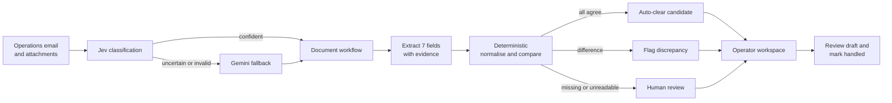
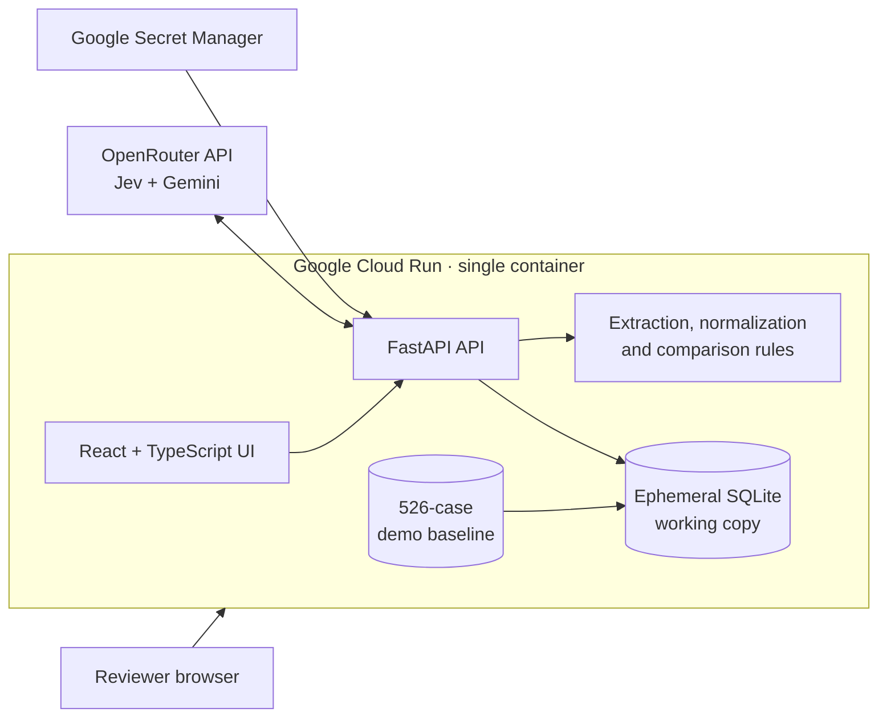

# SDOC Clearview

**Shipping documents, clearer decisions.**

## Team OhMyUTAR

- KoK Yong Sheng
- Chia Yue Sheng
- Vianne Chong Huiyu
- Cheah Ken Win
- Chin Kah Wen

SDOC Clearview is a human-in-the-loop operations workspace that classifies
shipping emails, compares Shipping Instructions (SI) with draft Bills of Lading
(BL), surfaces field-level discrepancies with source evidence, and prepares a
reply for an operator to review. It turns a document-heavy inbox into a focused
work queue without allowing the system to send customer email autonomously.

Built for the **Averis × Monash Hackathon 2026**.

## Submission links

| Deliverable | Public link |
|---|---|
| Live prototype | [Open SDOC Clearview](https://sdoc-clearview-821121433502.asia-southeast1.run.app) |
| Demo video & pitch deck | [Open Google Drive folder](https://drive.google.com/drive/folders/1GywjgPJgQWtBzhEp45ecYdWzkm2S3ryf?usp=sharing) |
| Slide deck / documentation | [Hackathon submission brief](docs/SUBMISSION.md) |
| Deployment guide | [Google Cloud Run deployment](docs/CLOUD_RUN_DEPLOYMENT.md) |
| Benchmark report | [Jev and Gemini benchmark](backend/benchmarks/results/latest.md) |

> Before submitting the Google Form, test every public link in an incognito browser.

## The problem

Shipping operations teams receive high volumes of emails with instructions,
draft documents, amendments, and routine requests. Checking a draft BL against
its SI is repetitive, but an overlooked consignee, port, container count, or
weight can create delays and costly rework. Generic automation is difficult to
trust when it presents a conclusion without the source evidence or silently
sends a response.

SDOC Clearview combines AI routing with deterministic document checks and a
human approval boundary. The operator sees what needs attention, the exact
values compared, why the case was flagged, and the proposed next action.

## What the prototype does

1. **Classifies the email** into BL comparison, SI request, invoice query,
   general notice, or spam.
2. **Routes uncertainty** through a benchmark-selected Jev → Gemini policy.
3. **Finds the SI and draft BL**, including text documents, PDFs, office files,
   and scanned document images supported by the extraction path.
4. **Extracts seven operational fields** with source text and evidence spans.
5. **Normalizes and compares the fields deterministically** so the same inputs
   always produce the same discrepancy decision.
6. **Prioritizes the work queue** into action required, no action, and handled
   cases.
7. **Creates a reviewable reply draft** while keeping email sending outside the
   system.
8. **Records human corrections** for audit, mapping suggestions, and regression
   testing.

The seven checked fields are shipper, consignee, notify party, port of loading,
port of discharge, container count, and gross weight.

## Product workflow



## AI and cloud architecture



The production demo is packaged as one Docker image. FastAPI serves the compiled
React application and API from the same Cloud Run URL. The image contains a
read-only 526-case baseline; each container creates a writable working copy in
`/tmp` so **Reset Demo** can restore the known state.

This is intentionally a resettable Hackathon deployment. Session changes do not
survive a Cloud Run instance replacement. The production roadmap moves shared
operator state to Cloud SQL and attachments to Cloud Storage.

## Model strategy and measured results

Classification uses Jev first because it is fast, low cost, and returns a
probability for a constrained decision. Results below the configured `0.80`
threshold, unavailable responses, or invalid category/intent pairs fall back to
Gemini. Gemini also handles generative and multimodal work outside Jev's
choice-model scope.

The same five-class routing task was evaluated on **520 labelled shipping
emails**:

| Model | Accuracy | Macro F1 | Effective time / email | Reported cost |
|---|---:|---:|---:|---:|
| Jev | **98.85%** | 0.9821 | 25.3 ms | $0.013402 / 520 cases |
| Gemini | **99.81%** | 0.9987 | 59.0 ms | Provider did not return cost |

At the `0.80` Jev confidence threshold, the benchmark reported **98.46% primary
coverage**, **99.80% accuracy among accepted cases**, and 8 fallback cases. These
figures measure email routing only; they do not claim OCR or end-to-end document
accuracy. Confidence values are displayed with their source because Jev's
probability and Gemini's self-reported JSON confidence are not equivalent.

Full methodology and per-category results are in
[`backend/benchmarks/results/latest.md`](backend/benchmarks/results/latest.md).

## Human control and explainability

- Every stage emits a trace containing the result, reason, execution details,
  latency, model, and routing outcome.
- Every extracted field keeps its raw value, normalized value, source, and text
  span where available.
- Document comparison is rules based and records the matching rule used.
- Replies remain drafts. The prototype has no SMTP integration and cannot send
  mail by itself.
- Operators can correct values, accept an exception, add mapping suggestions,
  and mark a case handled.
- The queue separates work requiring action from informational/spam cases and
  completed operator work.

## Technology stack

| Layer | Technology |
|---|---|
| Frontend | React 19, TypeScript, Vite |
| Backend | FastAPI, Python 3.12, Uvicorn |
| AI routing | Jev primary, Gemini fallback through OpenRouter |
| Document logic | Python extraction, normalization, deterministic comparison |
| Demo data | SQLite plus a committed 526-case baseline |
| Cloud | Google Cloud Run, Cloud Build, Secret Manager |
| Packaging | Multi-stage Docker build |

## Run locally

### Prerequisites

- Python 3.12+
- Node.js 22+
- An OpenRouter API key for the full Jev → Gemini workflow

### 1. Configure the backend

```powershell
Copy-Item backend/.env.example backend/.env
```

Set these values in `backend/.env`:

```dotenv
LLM_BACKEND=operational
OPENROUTER_API_KEY=your_openrouter_key
CLASSIFICATION_FALLBACK_THRESHOLD=0.80
```

Secrets are ignored by Git. Never commit `backend/.env`.

### 2. Start the API

```powershell
cd backend
python -m venv .venv
.\.venv\Scripts\Activate.ps1
pip install -r requirements.txt
python -m uvicorn app.main:app --host 127.0.0.1 --port 8000
```

### 3. Start the web application

In another terminal:

```powershell
cd frontend
npm install
npm run dev
```

Open `http://localhost:5173`. Vite proxies `/api` to FastAPI.

Without a provider key, the application can expose deterministic document logic
but cannot perform real model classification. It reports the model as unavailable
instead of inventing a result.

## Run the checks

```powershell
cd backend
$env:LLM_BACKEND='deterministic'
python tests/test_pipeline.py
```

```powershell
cd frontend
npm run build
```

The full 520-case model benchmark makes paid external API calls. The repository
includes its latest saved report so reviewers do not need to rerun it.

## Deploy to Google Cloud Run

The production image builds the frontend, installs the API, seeds an ephemeral
working data directory, and serves everything on Cloud Run's `$PORT`.

Follow [`docs/CLOUD_RUN_DEPLOYMENT.md`](docs/CLOUD_RUN_DEPLOYMENT.md) for Secret
Manager setup, deployment, and verification. Recommended demo limits are one
instance, 1 CPU, 2 GiB memory, and concurrency 8.

## Repository layout

```text
backend/
  app/
    engines/          classification, extraction, comparison, decisions
    llm/              Jev, Gemini/OpenRouter clients and confidence routing
    db.py             SQLite state and reset logic
    main.py           FastAPI endpoints and production static hosting
  benchmarks/results/ saved 520-case evaluation reports
  data/               labelled corpus, attachments and demo baseline
  tests/              deterministic pipeline checks
frontend/
  src/                queue, case workspace, analytics and benchmark UI
docs/
  SUBMISSION.md       organizer-aligned written response
  CLOUD_RUN_DEPLOYMENT.md
Dockerfile            React build + FastAPI runtime image
```

## Current scope and roadmap

The current build is a public, resettable prototype. It proves the workflow,
model routing, evidence experience, and human review loop.

The next production step is a genuinely shared data layer:

1. **Cloud SQL for PostgreSQL** for durable cases, review states, model runs,
   feedback, and audit history across operators and Cloud Run instances.
2. **Cloud Storage** for source documents and generated artifacts.
3. **Identity-Aware Proxy or Identity Platform** for authenticated roles and
   customer-data access controls.
4. **Pub/Sub and Cloud Run Jobs** for asynchronous ingestion, retries, and large
   benchmark or batch workloads.
5. **Versioned feedback governance** so approved corrections become controlled
   mappings and regression tests before release.
6. **Mailbox integration and approval receipts** after security and operational
   controls are in place.

See the complete organizer-aligned answers in
[`docs/SUBMISSION.md`](docs/SUBMISSION.md).
