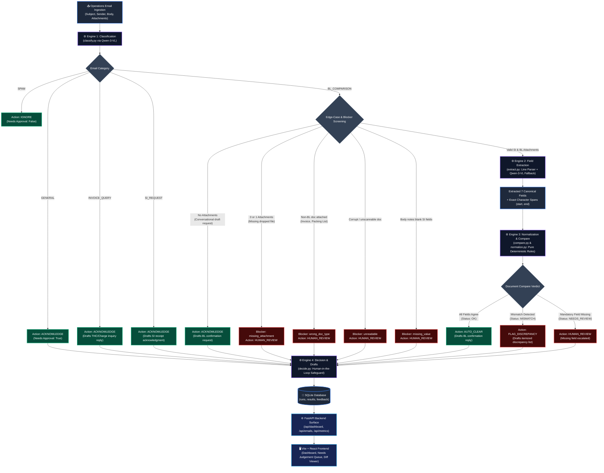

# Backend Architecture & Frontend Integration Guide (`sdoc-clearview`)

This document is the complete technical and architectural guide for frontend developers building, styling, or extending the **sdoc-clearview** UI. It explains the end-to-end processing pipeline, data contracts, API specifications, and recommended UI patterns (side-by-side diffing, audit drawer, draft approvals, and judgment queues).

---

## 1. End-to-End System Workflow

The backend processes operations emails through four sequential engines. Grounded explainability is built into every step: every engine emits a structured `Trace` recorded in SQLite, and every document field carries exact character byte offsets (`span: {start, end}`) for inline UI text highlighting.



---

## 2. Decision Logic & Human-in-the-Loop Concept

Every processed email produces a **Decision**:
```typescript
interface Decision {
  action: "AUTO_CLEAR" | "FLAG_DISCREPANCY" | "HUMAN_REVIEW" | "ACKNOWLEDGE" | "IGNORE";
  why: string;
  needs_approval: boolean;
  needs_judgement: boolean;
  draft: DraftEmail | null;
}
```

### The 5 Operational Actions

| Action | When it Triggers | `needs_approval` | `needs_judgement` | Suggested UI Badge | Suggested UI Behavior |
| :--- | :--- | :---: | :---: | :--- | :--- |
| `AUTO_CLEAR` | SI and BL documents were compared and all 7 fields matched. | `true` | `false` | Green `Auto-cleared` | Routine queue. Operator clicks "Approve & Send" or downloads `.eml`. |
| `FLAG_DISCREPANCY` | Real mismatch found between SI and BL (e.g. gross weight differs, consignee name mismatch). | `true` | **`true`** | Red `Discrepancy` | **High priority queue**. Shows side-by-side diff highlighting with discrepancy draft. |
| `HUMAN_REVIEW` | Edge cases (wrong doc type, missing attachment, unreadable doc, missing values, or pipeline error). | `true` | **`true`** | Amber `Escalated / Review` | **High priority queue**. Explains the blocking reason; draft asks sender to rectify. |
| `ACKNOWLEDGE` | Routine non-comparison workflows (general inquiries, SI requests, conversational BL requests). | `true` | `false` | Blue `Acknowledge` | Low priority queue. Pre-drafted routine response. |
| `IGNORE` | Classified as `SPAM`. | `false` | `false` | Gray `Spam / Ignored` | Discarded; no draft generated; no operator action required. |

### The "66 Needs Judgement" Metric
When inspecting `/api/dashboard`, you will see:
- `needs_judgement: 66`
- `needs_approval: 420`
- `no_human_needed: 100` (40 spam emails + 60 general bulletins)

> **Frontend Design Note**:  
> The 66 emails with `needs_judgement === true` represent the **core operational work** of the shipping documentation team:
> - **46 emails** with `FLAG_DISCREPANCY` (genuine doc mismatches).
> - **20 emails** with `HUMAN_REVIEW` (the planted edge cases).  
> Create a dedicated **"Needs Judgement (66)"** tab or priority filter in the inbox list so operators can review critical discrepancies first!

---

## 3. API Specification & Endpoints

Base URL: `http://localhost:8000` (or `http://127.0.0.1:8000`)  
CORS: Allowed origins include `http://localhost:5173` and `http://127.0.0.1:5173`.

### 1. `GET /api/config`
Returns active backend configuration, active LLM model, and system capabilities.

**Response `200 OK`**:
```json
{
  "backend": "openrouter",
  "model": "qwen/qwen3-vl-8b-instruct",
  "cloud_available": false,
  "cloud_model": null,
  "escalation_enabled": false,
  "escalate_logp": 0.0,
  "emails_available": 520,
  "is_mock": false
}
```

---

### 2. `GET /api/dashboard?run_id={run_id}`
Returns aggregated metrics, stage funnel, category counts, verdict breakdowns, and top discrepancies for the active benchmark run. If `run_id` is omitted, defaults to the latest run.

**Response `200 OK`**:
```json
{
  "run": {
    "id": 8,
    "started_at": "2026-09-20T13:09:30.123",
    "finished_at": "2026-09-20T13:10:14.456",
    "backend": "openrouter",
    "model": "qwen/qwen3-vl-8b-instruct",
    "total": 520,
    "done": 520,
    "status": "completed",
    "error": null
  },
  "count": 520,
  "headline": {
    "emails": 520,
    "documents_compared": 109,
    "defects_found": 46,
    "needs_approval": 420,
    "needs_judgement": 66,
    "drafts_written": 420,
    "escalated": 0,
    "escalation_rate": 0.0,
    "avg_ms": 789.7,
    "avg_confidence": 0.962,
    "auto_cleared": 63,
    "no_human_needed": 100
  },
  "funnel": [
    {"stage": "Received", "count": 520, "note": "emails in the operations inbox"},
    {"stage": "Triaged", "count": 480, "note": "40 discarded as spam"},
    {"stage": "Needs documents", "count": 220, "note": "classified as a BL to check against an SI"},
    {"stage": "Compared", "count": 109, "note": "111 could not be compared (conversational or missing attachments)"},
    {"stage": "Discrepancy found", "count": 46, "note": "SI and BL disagree on at least one field"}
  ],
  "by_category": {
    "BL_COMPARISON": 220,
    "SI_REQUEST": 125,
    "INVOICE_QUERY": 75,
    "GENERAL": 60,
    "SPAM": 40
  },
  "by_action": {
    "ACKNOWLEDGE": 291,
    "AUTO_CLEAR": 63,
    "FLAG_DISCREPANCY": 46,
    "IGNORE": 40,
    "HUMAN_REVIEW": 20
  },
  "by_verdict": {
    "OK": 63,
    "MISMATCH": 46
  },
  "defect_fields": {
    "consignee": 21,
    "gross_weight_kg": 15,
    "shipper": 8,
    "container_count": 5,
    "port_of_discharge": 2
  },
  "attention": [
    {
      "email_id": "email_005",
      "subject": "TO CONFIRM DOCS _ 5RAE-72813...",
      "action": "FLAG_DISCREPANCY",
      "why": "SI and BL disagree on consignee",
      "category": "BL_COMPARISON",
      "confidence": 0.98,
      "defect_fields": ["consignee"]
    }
  ],
  "accuracy": {
    "scored": 520,
    "correct": 520,
    "rate": 1.0,
    "errors": 0,
    "caught_by_router": 0,
    "worst": []
  }
}
```

---

### 3. `GET /api/emails`
Fetches a list of emails for list/table rendering with filtering.

**Query Parameters**:
- `run_id` *(optional int)*: Benchmark run ID.
- `action` *(optional string)*: Filter by action (`AUTO_CLEAR`, `FLAG_DISCREPANCY`, `HUMAN_REVIEW`, `ACKNOWLEDGE`, `IGNORE`).
- `category` *(optional string)*: Filter by category (`BL_COMPARISON`, `SI_REQUEST`, `INVOICE_QUERY`, `GENERAL`, `SPAM`).
- `needs_approval` *(optional bool)*: `true` / `false`.
- `needs_judgement` *(optional bool)*: `true` / `false` (Quick filter for the 66 priority emails).

**Response `200 OK`**:
```json
{
  "run_id": 8,
  "count": 520,
  "emails": [
    {
      "email_id": "email_001",
      "subject": "TO CONFIRM DOCS _ 5RSG-00133 _ CALLAO_PERU...",
      "category": "BL_COMPARISON",
      "confidence": 0.98,
      "escalated": 0,
      "comparison_status": "OK",
      "action": "AUTO_CLEAR",
      "needs_approval": 1,
      "needs_judgement": 0,
      "total_ms": 320.5
    }
  ]
}
```

---

### 4. `GET /api/emails/{email_id}?run_id={run_id}`
Fetches the full payload for a single email, including raw document text, character spans for highlighting, comparison results, generated draft reply, blockers, and explainability traces.

**Response `200 OK`**:
```json
{
  "email_id": "email_121",
  "subject": "TO CONFIRM DOCS _ 5RAE-73753 _ BRISBANE_AUSTRALIA...",
  "from": "eileen_teo@aprilasia.com",
  "body": "Dear Mitchelle,\n\nPls assist to check the draft BL against the SI...",
  "attachments": [
    "attachments/email_121_SI.txt",
    "attachments/email_121_BL.txt"
  ],
  "classification": {
    "category": "BL_COMPARISON",
    "confidence": 0.98,
    "reason": "Requests to check draft BL against SI and revert with discrepancies",
    "escalated": false
  },
  "blockers": [],
  "documents": {
    "SI": {
      "text": "SHIPPING INSTRUCTION\nShipper/Exporter: APRIL FINE PAPER TRADING...\nGROSS WEIGHT: 20,842 KG",
      "fields": {
        "gross_weight_kg": {
          "raw": "20,842 KG",
          "value": "20842",
          "source": "deterministic",
          "span": {"start": 418, "end": 427, "label": "GROSS WEIGHT"}
        }
      }
    },
    "BL": {
      "text": "DRAFT BILL OF LADING\nShipper: APRIL FINE PAPER TRADING...\nGross Weight: 21,342 KG",
      "fields": {
        "gross_weight_kg": {
          "raw": "21,342 KG",
          "value": "21342",
          "source": "deterministic",
          "span": {"start": 443, "end": 452, "label": "Gross Weight"}
        }
      }
    }
  },
  "comparison": {
    "status": "MISMATCH",
    "has_defect": true,
    "defect_fields": ["gross_weight_kg"],
    "missing_fields": [],
    "detail": {
      "gross_weight_kg": {
        "status": "MISMATCH",
        "rule": "values_differ",
        "si": {
          "raw": "20,842 KG",
          "value": "20842",
          "span": {"start": 418, "end": 427, "label": "GROSS WEIGHT"}
        },
        "bl": {
          "raw": "21,342 KG",
          "value": "21342",
          "span": {"start": 443, "end": 452, "label": "Gross Weight"}
        }
      }
    }
  },
  "decision": {
    "action": "FLAG_DISCREPANCY",
    "why": "SI and BL disagree on gross_weight_kg",
    "needs_approval": true,
    "needs_judgement": true,
    "draft": {
      "to": "eileen_teo@aprilasia.com",
      "subject": "RE: TO CONFIRM DOCS _ 5RAE-73753 _ BRISBANE_AUSTRALIA...",
      "body": "Dear Sir/Madam,\n\nWe have checked the draft Bill of Lading against the Shipping Instruction and found the following discrepancies:\n\n  Gross Weight Kg\n    Shipping Instruction : 20,842 KG\n    Draft Bill of Lading : 21,342 KG\n\nBest regards,\nDocumentation Team",
      "status": "DRAFT -- not sent, awaiting human approval"
    }
  },
  "traces": [
    {
      "engine": "classify",
      "why": "BL_COMPARISON -- Requests check of attached SI vs draft BL",
      "model": "qwen/qwen3-vl-8b-instruct",
      "ms": 1240.2,
      "steps": [...]
    },
    {
      "engine": "compare",
      "why": "MISMATCH -- 1 discrepancy (gross_weight_kg)",
      "ms": 0.4,
      "steps": [...]
    }
  ],
  "total_ms": 1245.8,
  "feedback": []
}
```

---

### 5. `GET /api/emails/{email_id}/draft.eml`
Returns a standard RFC-822 formatted email file (`.eml`).  
Frontend behavior: Provide a **"Download .eml"** button so operators can open the drafted email in Microsoft Outlook, Thunderbird, or Apple Mail with headers and body prefilled.

---

### 6. `POST /api/emails/{email_id}/feedback`
Allows human operators to correct a model prediction, record feedback, or report a bug.

**Request Body**:
```json
{
  "kind": "category",
  "corrected_to": "BL_COMPARISON",
  "was": "GENERAL",
  "note": "Operator manually overrode classification"
}
```
*`kind` must be one of: `"category"`, `"field"`, or `"verdict"`.*

---

## 4. Frontend UI/UX Design & Implementation Guide

### A. Side-by-Side Diff Viewer with Character Span Highlighting
When viewing an email with `documents.SI` and `documents.BL`:
1. Render two columns: **Shipping Instruction (SI)** on the left, **Draft Bill of Lading (BL)** on the right.
2. In each document view, render the raw `doc.text`.
3. Use the character indices in `span: {start, end}` to slice and highlight the matched or mismatched substrings:
   ```typescript
   function renderHighlightedText(docText: string, span?: {start: number, end: number}, isMismatch: boolean = false) {
     if (!span) return docText;
     const before = docText.slice(0, span.start);
     const target = docText.slice(span.start, span.end);
     const after = docText.slice(span.end);
     return (
       <>
         {before}
         <mark className={isMismatch ? "bg-red-200 text-red-900 font-bold" : "bg-green-100 text-green-800"}>
           {target}
         </mark>
         {after}
       </>
     );
   }
   ```
4. When the user hovers over a field in the comparison table (e.g. `gross_weight_kg`), scroll and pulse the corresponding `<mark>` element in both document panes!

---

### B. The Decision & Draft Reply Drawer
For emails that have `decision.draft`:
1. Display the recipient (`draft.to`) and subject (`draft.subject`).
2. Show a badge stating: **`DRAFT -- Awaiting Operator Approval`**.
3. Render an editable `<textarea>` containing `draft.body` allowing the operator to adjust the wording before sending.
4. Actions:
   - **"Approve & Copy"**: Copies reply text to clipboard and marks status as approved.
   - **"Download .eml"**: Triggers `window.open('/api/emails/' + email_id + '/draft.eml')`.
   - **"Report Discrepancy"**: Submits human correction via `POST /api/emails/{email_id}/feedback`.

---

### C. Explainability / Trace Inspector
Underneath the email detail, render a **"Reasoning Trace & Audit Trail"** tab:
- Loop over `traces[]`:
  - Show engine name (`classify`, `extract`, `compare`, `decide`).
  - Show model used (`qwen/qwen3-vl-8b-instruct` or `deterministic`).
  - Show execution time in milliseconds (`ms`).
  - Show explanation sentence (`why`).
  - Accordion dropdown to inspect raw model tokens and inputs.

---

## 5. Running the Backend for Local Frontend Development

### Start Backend (Port 8000)
```powershell
cd backend
python -m uvicorn app.main:app --host 127.0.0.1 --port 8000 --reload
```

### Start Frontend (Port 5173)
```powershell
cd frontend
npm run dev
```

### Run Full Benchmark Evaluation
To score all 520 emails, start a run from the **Run pipeline** panel, or post
one directly:
```powershell
curl -s -X POST http://127.0.0.1:8000/api/runs -H "Content-Type: application/json" `
     -d '{"purpose":"benchmark","exclude_used":false,"workers":10}'
```

### Run Pipeline Tests
```powershell
cd backend
python tests/test_pipeline.py
```
*(All 12 engine test cases pass with 100% deterministic reproducibility).*
