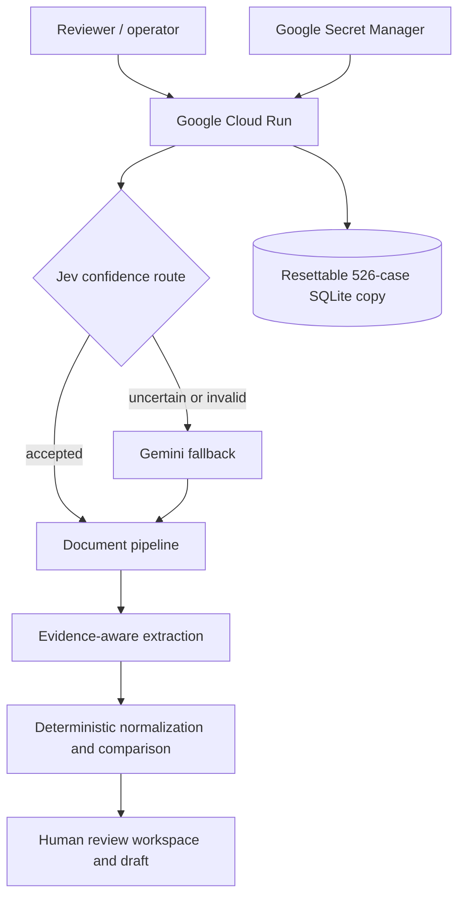

# SDOC Clearview — Hackathon Submission Brief

This document matches the Averis × Monash Hackathon 2026 submission
requirements. It can be shared directly on GitHub and reused in the slide deck,
demo video, and Google Form.

## Submission checklist

| Required item | Status | Public link / action |
|---|---|---|
| Project name and description | Ready | Use the text below |
| Demo video, maximum 5 minutes | Pending upload | YouTube Public/Unlisted or Drive “Anyone with the link” |
| Public GitHub repository | Pending clean snapshot | Add final repository URL |
| Public live prototype | Deployment in progress | Add Cloud Run URL |
| Slide deck or technical documentation | Draft ready | Link this document or export it to PDF |

Test every final URL while signed out or in an incognito window before
submitting.

## 1. Project name and description

### Project name

**SDOC Clearview — Shipping Documents, Clearer Decisions**

### Short description

SDOC Clearview is an AI-assisted shipping document verification workspace. It
classifies incoming operations emails, extracts and compares seven critical
fields from Shipping Instructions and draft Bills of Lading, shows the source
evidence behind every discrepancy, and prepares a response for human approval.
The system helps operators focus on real exceptions while preserving human
control over customer communication.

### Problem and purpose

Shipping document teams repeatedly review emails and compare draft Bills of
Lading against Shipping Instructions. The work is time consuming and small
errors in parties, ports, container counts, or weight can lead to shipment
delays, corrections, and avoidable operational cost. Existing automation can
also be difficult to trust when it returns a verdict without showing evidence.

SDOC Clearview addresses both issues. AI performs fast email routing and handles
uncertain or multimodal input, while deterministic rules perform the operational
field comparison. Operators receive a prioritized queue, a side-by-side evidence
view, an understandable decision trace, and a draft response that the system is
not permitted to send autonomously.

## 2. Problem–solution alignment

| Operational problem | Product response |
|---|---|
| High-volume mixed operations inbox | Five-class AI routing separates document checks, requests, notices, and spam |
| Manual SI versus BL comparison | Seven normalized fields are extracted and compared automatically |
| Hard-to-trust model decisions | Every field links to source evidence and every stage has a readable trace |
| Important exceptions mixed with routine work | Queue separates action required, no action, and handled cases |
| Risk of incorrect automated customer replies | Replies stay as drafts and require operator review |
| Repeated naming and formatting variants | Human corrections become reviewed mapping suggestions and regression cases |

The product uses AI where its flexibility is useful. Final field matching is
deterministic and reproducible, giving the operator a stable reason for each
match or mismatch.

## 3. AI and cloud infrastructure integration

### AI workflow

1. Jev classifies each email into one of five known operational categories.
2. A constrained category/intent schema and Jev confidence determine whether the
   result can be accepted.
3. A result below `0.80`, an unavailable answer, or an invalid schema falls
   back to Gemini.
4. Gemini also handles generative and multimodal work outside Jev's choice-model
   scope.
5. Extracted SI and BL fields are normalized and compared by deterministic
   rules.
6. The decision engine selects an action and constructs a reviewable draft from
   controlled templates.

### Cloud deployment

The complete React and FastAPI application is built into one Docker image and
deployed on Google Cloud Run. One public URL serves the interface and API,
avoiding browser cross-origin configuration during evaluation. Google Secret
Manager provides the OpenRouter key at runtime without placing credentials in
the repository or image.

The image includes a frozen 526-case dataset and baseline SQLite database. On
startup, the container creates a writable working copy under `/tmp`; Reset
Demo restores the known baseline. This produces a reliable evaluation
environment with no external database setup.

### Why this split matters

- Jev provides a fast constrained decision for the common path.
- Gemini provides broader language and multimodal capability for uncertain work.
- Deterministic comparison prevents a generative model from inventing whether
  two operational values match.
- Cloud Run supplies a reproducible public prototype that scales down when idle.
- Human approval remains the boundary before external communication.

## 4. Implementation details

| Stage | Implementation | Output |
|---|---|---|
| Classify | Jev primary, Gemini fallback | Category, intent, confidence source, reason, routing metadata |
| Identify documents | Filename and content inspection | SI and BL selection or explicit blocker |
| Extract | Parsers plus Gemini-assisted fallback | Seven fields, raw/normalized values, spans, source |
| Compare | Python normalization and deterministic rules | Per-field status and matching rule |
| Decide | Controlled action rules and templates | Auto-clear, discrepancy, review, acknowledge, no action, or ignore |
| Review | React workspace and FastAPI feedback endpoints | Corrections, mappings, handled status, downloadable `.eml` |

### Product surfaces

- **Work Queue:** separates action required, no-action cases, and handled cases.
- **Case Workspace:** combines email context, attachments, seven-field
  comparison, source evidence, next action, and reply draft.
- **Human Review:** focuses on discrepancies, missing information, unreadable
  input, and other blockers.
- **Decision Trace:** presents the five stages in readable cards while keeping
  provider, latency, confidence, and execution details available.
- **Analytics:** shows throughput, discrepancy categories, automation coverage,
  latency, and human workload.
- **Benchmark:** preserves the 520-case Jev and Gemini evaluation with
  per-category errors and confidence routing results.

### Data and safety choices

- SQLite is used for the single-instance demo and seeded from a frozen baseline.
- Provider keys remain in local `.env` files or Google Secret Manager.
- Drafts are never sent; no SMTP credentials or sending endpoint exists.
- Benchmark runs are separate from the operator queue.
- Reset restores rows by explicit column name, keeping historical and current
  SQLite schemas compatible.

## 5. User feedback and testing

### Feedback built into the workflow

Operators can correct a category, edit an SI or BL value, accept an operational
exception, record an override reason, nominate a reusable mapping, and mark a
case handled. Corrections are retained as audit records. Reusable fixes are
proposed as mapping candidates rather than silently changing the rule library.

### Evaluation performed

- A labelled corpus of 520 shipping emails covers five routing categories.
- Jev and Gemini received the same subject, sender, body, and attachment names.
- Precision, recall, F1, latency, token use, cost, and wrong cases were saved.
- Deterministic checks cover traces, evidence offsets, discrepancy detection,
  normalization, label variants, and unreadable input.
- The frontend production build is compiled as a release gate.
- Reset was tested against SQLite databases with different historical column
  orders after a migration issue was discovered.

For the preliminary round, user testing asks whether an operator can quickly
answer: **What happened? Where is the evidence? What do I do next?** Structured
testing with shipping documentation professionals is part of the roadmap.

## 6. Coding challenges

### Confidence was not one universal number

Jev returns a probability-derived confidence for constrained choices, while
Gemini returns a value inside generated JSON. The implementation stores routing
confidence separately, labels the source, and shows when fallback was used.

### Explainability without a wall of JSON

Rich raw traces made the page long and difficult to scan. The interface was
redesigned around a summary and five-stage flow. Human-readable results and
evidence appear first; provider, latency, routing, and raw details remain
available through expansion.

### Ambiguous shipping labels and formats

Company suffixes, UN/LOCODE ports, weights, and “To the Order of” consignees
require domain-aware normalization. Extraction and comparison are separate so
evidence stays faithful to the source while normalized values use explicit,
testable rules.

### Reliable reset across database migrations

An early reset copied SQLite rows by physical position. Older databases had a
different column order after migration, shifting values into the wrong fields.
Reset now copies an explicit list of column names, and the committed baseline
makes a fresh clone reproducible.

### Ephemeral cloud container storage

Cloud Run instances do not provide durable local storage. The demo treats the
database as resettable session state: a read-only baseline lives in the image and
a working copy is created at startup. This is reliable for judging and clearly
separated from the future shared database design.

## 7. Success metrics

### Measured model results

| Metric | Jev | Gemini |
|---|---:|---:|
| Accuracy, 520 labelled emails | **98.85%** | **99.81%** |
| Macro F1 | 0.9821 | 0.9987 |
| Effective time per email | 25.3 ms | 59.0 ms |
| BL comparison recall | 100.00% | 99.55% |
| Jev reported total cost | $0.013402 | Not returned by provider |

At the selected `0.80` threshold, Jev accepted 98.46% of benchmark cases with
99.80% accepted-case accuracy; eight cases were reserved for fallback. This
supports using Jev for the common path and Gemini for the uncertain tail.

### Operational metrics in the product

- cases requiring action and cases needing no action;
- auto-clear candidates, discrepancies, and human review blockers;
- most frequent mismatch fields;
- average end-to-end processing time;
- model fallback and low-confidence rate;
- handled cases and correction history.

### Next validation metrics

- median operator review time compared with manual checking;
- false auto-clear rate, targeting zero on critical discrepancies;
- percentage of drafts requiring material edits;
- agreement between operators on review decisions;
- time from inbound email to approved response;
- accuracy by document type, scan quality, customer, and route.

## 8. Scalability plan and future roadmap

The most important next step is a **genuinely shared database**. The current
SQLite copy fits a single-instance judging demo but cannot provide durable
multi-user state across Cloud Run instances.

### Phase 1 — Shared operational state

- Replace SQLite with **Cloud SQL for PostgreSQL**.
- Store cases, assignments, model runs, feedback, and audit events in a shared
  transactional schema.
- Move uploaded documents to **Google Cloud Storage**, keeping object references
  and checksums in the database.
- Add migrations, backups, retention policies, and idempotent ingestion.

### Phase 2 — Secure multi-user workflow

- Add Google Identity Platform or Identity-Aware Proxy.
- Introduce operator, reviewer, and administrator roles.
- Add case ownership, SLA tracking, approval receipts, and immutable audit logs.
- Encrypt sensitive documents and apply customer-specific access and retention.

### Phase 3 — Asynchronous scale

- Use Pub/Sub or Cloud Tasks for inbound processing and retries.
- Run long benchmarks and bulk processing through Cloud Run Jobs.
- Scale the API horizontally after state moves to Cloud SQL and Cloud Storage.
- Add dead-letter handling, rate controls, provider failover, and monitoring.

### Phase 4 — Controlled continuous improvement

- Review mapping suggestions before publishing versioned rule bundles.
- Promote operator corrections into regression suites.
- Shadow-evaluate model and prompt versions before rollout.
- Expand beyond seven fields and support customer-specific policies.
- Integrate mailboxes and sending only after identity, approval, and audit
  controls are complete.

## 9. Technical architecture summary

| Area | Current Hackathon prototype | Production evolution |
|---|---|---|
| Hosting | One Google Cloud Run container | Horizontally scaled Cloud Run services |
| Database | Resettable SQLite working copy | Cloud SQL for PostgreSQL |
| Files | Baseline and session uploads in container | Cloud Storage with lifecycle controls |
| Processing | Synchronous FastAPI workflow | Pub/Sub / Cloud Tasks and Cloud Run Jobs |
| Identity | Public judging demo | IAP / Identity Platform and role-based access |
| AI | Jev primary, Gemini fallback | Versioned routing, shadow evaluation, monitoring |
| Feedback | Corrections and mapping candidates | Governed rule publication and regression gates |

## 10. Five-minute demo video structure

Target approximately 4:30 to remain safely below the limit.

| Time | Required content | What to show |
|---:|---|---|
| 0:00–0:20 | Quick intro | Team name, SDOC Clearview, one-sentence value |
| 0:20–0:55 | The problem | Manual checking, operational risk, trust gap |
| 0:55–1:25 | Tech stack | Cloud Run architecture and Jev → Gemini routing |
| 1:25–3:40 | Live demo | Queue → discrepancy → evidence → trace → handled → analytics |
| 3:40–4:15 | Testing and impact | 520-case benchmark, accuracy, latency, human control |
| 4:15–4:35 | Roadmap | Cloud SQL, Cloud Storage, identity, async processing |
| 4:35–4:45 | Close | Restate outcome and show prototype URL |

## 11. Final submission checks

- [ ] Team and representative details are correct in Google Forms.
- [ ] Cloud Run URL opens without sign-in and `/api/health` succeeds.
- [ ] Reset Demo works, a case opens, and attachments/evidence render.
- [ ] GitHub is public and setup steps work from a fresh checkout.
- [ ] No `.env`, API key, private email, or unrelated artifact is exposed.
- [ ] Video is below five minutes and publicly viewable.
- [ ] Slide deck/document is publicly viewable.
- [ ] Placeholder links in README and this document are replaced.
- [ ] Every link was tested while signed out.
