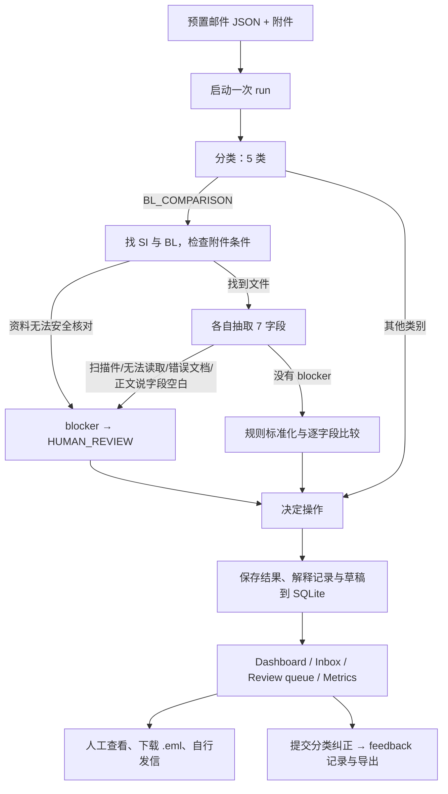

# SDOC Clearview — Workflow、UI 与改进讨论 Handoff

> 更新日期：2026-09-20。本文依据**当前仓库代码**、现有样本数据库和本地验证整理，供下一位 GPT 直接接手产品讨论。请先区分「代码已经实现」「样本运行结果」「设计建议」；不要把旧 README 中的规划描述当作现状。

## 1. 给下一位 GPT 的任务

请以航运单证操作员为主要用户，审视 SDOC Clearview 的端到端工作流程，提出能落地的 UI/UX 和系统改进方案。重点回答：

1. 一封邮件从进入收件箱，到被分类、核对 SI 与 draft BL、人工判断、形成回复和关闭任务，应该有哪些明确状态与责任人？
2. 如何让操作员**先处理真正需要判断的 66 条**，同时高效签核其余常规草稿？
3. 邮件详情页怎样组织原始邮件、SI/BL 原文、七字段差异、证据、解释记录和回复草稿，减少来回切换？
4. 哪些误判风险需要通过交互或后端约束防住？尤其是“机器认为一致”但字段来源弱、资料缺失、扫描件、错误附件的情况。
5. 请给出信息架构、关键用户流程、页面线框或组件结构、状态模型、API/数据模型变更、优先级与验收标准。说明每一项建议依赖现有能力还是新增开发。

期望输出：先给可用于 hackathon 演示的最小闭环，再给生产化路线；用具体页面/状态/操作描述，避免只给视觉风格词。

## 2. 产品是什么

SDOC Clearview 是一个航运单证邮件处理原型。输入为预置的 operations email、正文和附件；系统把邮件分到五类，若是 draft Bill of Lading（BL）核对请求，则找出 Shipping Instruction（SI）和 BL，抽取七个关键字段，按规则比较，给出行动建议及一封**未发送**的回复草稿。操作员可以查看原始证据和每步处理记录，并记录分类纠正。

当前是本地 hackathon demo，不是一个已经接入真实邮箱的多人业务系统。仓库有 520 封样本邮件、250 个附件，支持 `.txt`、`.docx`、`.xlsx`、`.pdf` 文本读取，以及部分 PDF 扫描图片读取。后端 FastAPI + SQLite；前端 React 19 + TypeScript + Vite，无组件库。

产品的核心价值不是“自动发信”，而是**可审核的辅助判断**：比较规则可复现，抽取字段尽量关联原文位置，回复草稿必须由人检查并在自己的邮件客户端发送。

## 3. 代码层面的真实流程



### 3.1 分类

- 分类值：`BL_COMPARISON`、`SI_REQUEST`、`INVOICE_QUERY`、`GENERAL`、`SPAM`。
- 普通情况调用当前配置的模型客户端；部分无附件且正文明确提交 SI 的邮件走规则快速通道。
- 当前 `classification.escalated` 始终为 `false`。仓库保留 `router.py` 和旧路由相关字段，但配置里升级路由关闭，也没有在分类流程中调用它。**不要把“低置信度自动转云端”写成当前能力。**
- 使用 mock 时是规则模拟；使用 Gemini/OpenRouter 时是直接调用云模型。现有客户端选择逻辑没有真正接上 Ollama 分支，尽管 `.env.example` 和旧 README 提到了 Ollama。
- 不支持 logprobs 的云端回复如果没有自带 confidence，分类代码使用默认 `0.8`。UI 不应把这个值当成经过校准的真实概率。

### 3.2 SI/BL 核对

只有 `BL_COMPARISON` 进入附件核对。无附件可以是单纯请求 draft BL 的对话式邮件，或是遗漏附件；一份附件、找不到 SI/BL、扫描件/无法读取、错误单证类型，以及正文明确说字段空白，都会进入人工复核。扫描件即使由视觉模型读出字段，目前依然被标记为需要人工核验，不会自动比较放行。

七字段：`shipper`、`consignee`、`notify_party`、`port_of_loading`、`port_of_discharge`、`container_count`、`gross_weight_kg`。先按标签/文本规则解析，缺失字段才问模型。每个字段保存原值、标准化值、来源、置信度及可用时的文本位置。文本证据位置供 UI 高亮；扫描件无文本位置，只显示图片。

比较引擎**不用模型**，逐字段返回 `MATCH` / `MISMATCH` / `MISSING` 和规则名。整体状态：有任一不一致为 `MISMATCH`；没有不一致但有缺失为 `NEEDS_REVIEW`；七字段齐且一致为 `OK`。不同单位、港口写法和企业名称做标准化；实体前缀及 token overlap 也可判为匹配，这些宽松规则应在 UI 中可辨认并接受人工质疑。

### 3.3 行动与回复

当前实际有**六种**行动（旧集成文档写五种，漏了 `NO_ACTION`）：

| Action | 场景 | `needs_judgement` | `needs_approval` | 草稿 |
|---|---|---:|---:|---|
| `FLAG_DISCREPANCY` | SI/BL 有字段不一致 | 是 | 是 | 列明差异 |
| `HUMAN_REVIEW` | blocker、字段缺失或无法完成比较 | 是 | 是 | 人工复核说明；异常时可能无草稿 |
| `AUTO_CLEAR` | 七字段规则核对一致 | 否 | 是 | 确认草稿 |
| `ACKNOWLEDGE` | SI 请求、费用问题或对话式 BL 请求 | 否 | 是 | 收件确认 |
| `NO_ACTION` | 一般通知/公告 | 否 | 否 | 无 |
| `IGNORE` | 垃圾邮件 | 否 | 否 | 无 |

`needs_judgement` 表示需要人**作业务判断**；`needs_approval` 表示回复草稿需要人签核/发送，两者不能混为一个“待办”。草稿内容由**确定性模板**拼成，`reasoning` 是随草稿保存的决策依据；目前并没有调用 LLM 来撰写草稿。系统不具备发送邮件的 API，只提供 `.eml` 下载。`AUTO_CLEAR` 是机器比对结果，**不是已获人类批准或已对外发送**。

### 3.4 解释与反馈

每个引擎输出 `Trace`：输入、步骤、输出、原因、模型/后端、confidence、耗时、token 等；一封比较邮件通常有 classify、两次 extract、compare、decide 共五条 trace。人可在详情页逐层展开。

后端 `POST /api/emails/{email_id}/feedback` 接收 `category` / `field` / `verdict` 纠正，存到 SQLite。当前 UI **只提供分类纠正**；field/verdict 需要新交互。导出接口生成命名别名建议和 regression case JSON，**没有自动修改标准化规则、重跑记录、改变当前 verdict 或接入 CI**。这是讨论反馈闭环时必须补上的断点。

## 4. 现在的 UI 与操作路径

顶栏有 Dashboard、Inbox、Review queue、Metrics、Feedback loop、Settings，以及批量启动 pipeline 的按钮和处理数量下拉。一次 run 在后台线程处理样本邮件，前端每 400 ms 轮询进度。主要页面：

| 页面 | 已有能力 | 关键限制 |
|---|---|---|
| Dashboard | 数量、流程漏斗、类别/行动分布、差异字段、需关注邮件等 | 是一次 run 的分析视图，不是实时业务待办；默认看最新 run |
| Inbox | 邮件列表、类别筛选、分类/动作/置信度标签、右侧详情 | 无搜索、排序、分页、负责人、处理状态、键盘快捷键 |
| Review queue | “Needs a decision”和“Awaiting sign-off”两组过滤 | `needs_approval` 是生成草稿时的静态标志，操作后不会消失 |
| Email detail | Pipeline、Documents & evidence、Comparison、Drafted reply、Email source 五个 tab；分类纠正 | 文档和差异分 tab，核对要来回切；两份文档在 Documents tab 中上下排列；差异行不能直接定位两边证据 |
| Drafted reply | 展示收件人、主题、正文、决策依据；下载 `.eml` | 正文不可编辑；无“批准/拒绝/已发送/关闭”持久状态 |
| Metrics | 基于 run 的分类准确率、耗时和分布等 | 与真实处理效率不同；保留旧“router/cloud escalation”文案，当前路由未启用，易误导 |
| Feedback loop | 展示反馈导出、别名建议、回归用例 | 纠正并未自动生效；空状态文案把分类纠正误说成别名建议 |
| Settings | 主题选择、后端配置只读展示 | 设置和顶栏仍有旧本地/云升级文案，与当前后端选型不一致 |

页面是深浅主题均可用的自定义 CSS。当前主体布局为列表 + 详情双栏；详情内部多 tab。适合 demo，但高频操作员需要更明确的优先级、任务状态和“一屏完成判断”的证据布局。

## 5. 数据与 API 契约

关键结果结构（简化）：

```ts
type EmailResult = {
  email_id: string; subject: string; from: string; body: string;
  classification: { category: string; confidence: number; reason: string; escalated: boolean };
  blockers: string[];
  documents: { si?: DocumentView; bl?: DocumentView };
  comparison: null | {
    status: 'OK' | 'MISMATCH' | 'NEEDS_REVIEW';
    defect_fields: string[]; missing_fields: string[];
    detail: Record<string, { status: 'MATCH' | 'MISMATCH' | 'MISSING'; rule: string; si: FieldEvidence; bl: FieldEvidence }>;
  };
  decision: {
    action: string; why: string;
    needs_approval: boolean; needs_judgement: boolean;
    draft: null | { to: string; subject: string; body: string; status: string; reasoning: object };
  };
  traces: Trace[]; total_ms: number;
};
```

当前接口：`GET /api/config`、`POST /api/runs`、`GET /api/runs`、`GET /api/runs/{id}`、`GET /api/dashboard`、`GET /api/metrics`、`GET /api/emails`、`GET /api/emails/{id}`、`GET /api/emails/{id}/draft.eml`、`POST /api/emails/{id}/feedback`、`GET /api/feedback/export`。Dashboard / Metrics / Emails 支持 `run_id` 参数（列表还支持 action、category、needs_approval、needs_judgement）；前端目前没有 run 切换器，通常看最新 run。

SQLite 只有 `runs`、`results`、`feedback` 三表。`results` 以 `(email_id, run_id)` 为键；处理结果是不可变快照式 payload。没有任务状态、审批动作、草稿版本、分派或发送记录表。讨论新 workflow 时建议先定义这些对象和状态转移，不要仅给按钮改名。

## 6. 可验证的当前快照与测试

仓库现有数据库中最新的 run #2 是 Gemini `gemini-3.1-flash-lite` 处理 520 封样本后的结果：

- 行动：`ACKNOWLEDGE 291`、`AUTO_CLEAR 63`、`FLAG_DISCREPANCY 46`、`HUMAN_REVIEW 20`、`NO_ACTION 60`、`IGNORE 40`。
- 因此 `needs_judgement = 66`，`needs_approval = 420`；完成 SI/BL 比对的是 `63 OK + 46 MISMATCH = 109`。
- 这是**仓库中某次已保存的样本运行快照**，不是新数据的保证，也不等于生产准确率。反馈表当前为 0 条。
- 前端 `npm run build` 成功。后端 12 个 pipeline 检查在明确设置 `LLM_BACKEND=mock` 时全部通过。直接按本机现有 `.env` 运行测试会切到外部模型，且其中一个检查因未产生 comparison 而失败：测试的 deterministic 前提需要在命令或测试配置中固定。

旧 README 关于“完全离线”、Ollama 本地路由、10% escalation catch rate、模型实测精度等属于不同实现/历史实验。当前代码并没有完整执行那套两级路由；设计稿及演示口径应以本节和实时 `/api/config` 为准。尤其不要在 Gemini/OpenRouter 模式仍显示“offline / answering locally”。

## 7. 需要讨论并设计的目标 Workflow

建议把**系统判断**与**人工处理**分成两条轴：

1. 系统判断：`UNPROCESSED → PROCESSING → RESULT_READY / PIPELINE_ERROR`；`RESULT_READY` 再显示分类、比较状态、行动建议、证据完整度。
2. 人工处理：`UNASSIGNED → ASSIGNED → IN_REVIEW → RESOLVED / RETURNED_FOR_INFO / DISMISSED`。草稿另有 `DRAFT → EDITED → APPROVED → EXPORTED → SENT_CONFIRMED` 等状态，是否需要“已发送”须由真实邮件集成能力决定。

这些只是**提议的模型**，目前数据库没有对应字段或 API。下一位 GPT 应检查状态是否过多，给出最小 demo 版本及每个状态的进入条件、操作人、审计记录、可撤销方式。

### 推荐先讨论的任务旅程

1. **正常一致**：打开 `AUTO_CLEAR` → 看七字段覆盖率、来源和规则 → 检查原文 → 审核/修改草稿 → 导出 `.eml` → 标记已处理。应避免“Auto-cleared”让人误以为已经发信。
2. **字段冲突**：从“Needs a decision”进入 → 默认聚焦冲突字段 → SI/BL 原文与字段值并排联动 → 判断是实际差异还是解析/规则问题 → 选择“要求更正 BL / 修改系统判断 / 暂缓” → 再决定回复措辞。
3. **资料阻塞**：明确写出缺的附件/字段、错误类型或扫描验证要求 → 展示可以做什么、不能做什么 → 请求补件或分派人工核验，避免空草稿流入签核队列。
4. **模型分类错**：修改类别 → 界面说明“已记录反馈，但当前 run 结果不会自动重算” → 提供重跑或人工 override 方案，并说明其对队列/草稿的影响。
5. **公告/垃圾邮件**：可快速查看与纠错；不要将 `NO_ACTION` 和 `IGNORE` 当作已被人工确认。

## 8. UI 设计方向与具体问题

### 8.1 信息架构

建议以 **Work queue / Email workspace / Analytics / Feedback / Settings** 组织。Dashboard 中当前的 run 分析可保留，但操作员打开产品的默认视图更适合显示“需要我处理什么”。考虑把“判决队列”和“草稿签核”作为不同的队列，并在所有列表上统一显示真实处理状态、未处理时间和理由。

### 8.2 核心工作台

建议下一位 GPT 给出桌面宽屏和窄屏线框：左侧可搜索/排序的待办列表，中间邮件与单证证据，右侧行动/草稿。冲突字段应能从列表和摘要一键跳到 SI 与 BL 两侧证据。显示 `raw` 与 `normalized` 的差别、匹配规则及来源；宽松匹配（如企业名前缀/token overlap）用“需留意的匹配依据”表达，而不是和完全相同值一样呈现。扫描件没有文字高亮时，需要明确的“图像读取、人工验证必需”状态。

重要交互：对“无法比对”显示 blocker 的结构化原因和建议下一步；把字段级纠正入口放在字段旁，而不是仅在页面底部放分类纠正；草稿提供可编辑版本及保存/审核流程；操作后队列计数应更新。需要区分**机器置信度**、**字段证据完整度**、**人工处理状态**，避免一个颜色或百分比承担三种语义。

### 8.3 视觉和可用性

- 优先级建议由 `FLAG_DISCREPANCY`、`HUMAN_REVIEW` 和 blocker 驱动，置信度只作辅助信号。
- 同一差异在列表、对照表、原文高亮、草稿引用之间使用稳定标签和颜色；颜色之外也要有文字/图标。
- 页面要考虑长邮件主题、长公司名、跨语言单证、无文字层 PDF、空数据、处理中、API 出错、单封处理失败。
- 详细 trace 适合可展开的审计层；默认主界面先回答“发生什么、证据在哪、下一步是什么”。

## 9. 改进清单（按收益与依赖排序）

### P0 — 演示口径和信任修正

1. 修正 `App.tsx`、Settings、Metrics、Dashboard/Badges 中与当前实现不符的 offline、本地模型、云升级和 router 提示；只显示 `/api/config` 能证明的能力。清楚标识 mock 与真实模型。
2. 修正旧文档中的六种行动、`documents.si/bl` 小写键、草稿为模板、不能自动发送、反馈未自动生效等差异。
3. 明确 `AUTO_CLEAR` 表示核对结论，不表示人工已签核；`needs_approval` 是静态待办标志，不是已保存的审批流程。
4. 测试运行固定 mock，避免被开发者本地 `.env` 静默切换模型。

### P1 — 最小可用的人工处理闭环

1. 增加 review 状态与审核动作 API（接受/纠正/请求补件/搁置），记录操作人、时间、原因和 run/result 版本；让队列能够真正清空。
2. 增加草稿编辑与版本保存；下载 `.eml` 应使用所批准的版本。系统继续不直接发送邮件，除非未来明确引入发送集成和权限。
3. 设计“字段纠正 → 重算比较与行动 → 重新检查草稿”的安全流程；避免仅记录反馈却保留旧判决和旧草稿继续使用。
4. 把证据与差异并排联动，减少目前多 tab 往返；提供可定位的字段焦点、缺失状态及扫描件提示。
5. 列表增加搜索、排序、处理状态、优先级和真实待办计数；考虑 520 项的分页/虚拟化。

### P2 — 准确性、扩展和运营

1. 将 blocker 从自由文本改为稳定 code + 说明 + 建议动作；分别衡量错误文档、少附件、缺字段、扫描人工核验。
2. 做模型/规则准确性与覆盖率的分层评估；按类别、文件格式、字段来源、宽松匹配规则展示错误，而非只给单个准确率。
3. 针对云端模型的默认 `0.8` confidence，提供可靠的风险标记或明确显示“未校准”，避免精确百分比误导。
4. 建立反馈审核、别名规则发布、回归用例执行与版本对照；目前导出只是建议，尚非闭环。
5. 若走生产路线，再设计真实邮箱接入、鉴权、角色、敏感数据处理、审计/保留策略、幂等与重试、并发运行隔离、邮件发送回执等。

## 10. 给 GPT 的约束与开放问题

**约束：** 保留“规则比对可解释、原文证据可追、人工对外发信”的核心；优先设计可在现有 React/FastAPI/SQLite 上增量实现的方案。不要假设系统已有邮箱同步、批准按钮、真实发送、多人角色或自动应用反馈。样本数量和上面的 66/420 是当前 run 快照，不应硬编码到 UI。

**开放问题（请给建议并标明需要业务方确认的项）：**

- 谁对 `AUTO_CLEAR` 的核对和外发负最终责任？是否需要双人签核高风险客户或高金额货物？
- “已处理”的依据是导出 `.eml`、操作员自行确认已发送，还是未来真实邮箱发件回执？
- 字段差异是否允许操作员 override 为“业务上可接受”，如何保存原因与审计？
- SI/BL 的七字段对该团队是否足够？是否需要客户/航线特定必填字段和容差？
- 用户最重视的成功指标是判断时间、错误拦截、补件周转、草稿编辑量，还是其他？

## 11. 接手时优先读的文件

| 目的 | 文件 |
|---|---|
| 后端流程 | `backend/app/pipeline.py`, `backend/app/engines/{classify,extract,compare,decide}.py` |
| API 与状态 | `backend/app/main.py`, `backend/app/db.py`, `backend/app/config.py` |
| 结果类型与调用 | `frontend/src/types.ts`, `frontend/src/api.ts` |
| UI 入口和队列 | `frontend/src/App.tsx`, `frontend/src/pages/Inbox.tsx`, `frontend/src/components/EmailDetail.tsx` |
| 证据和草稿 | `frontend/src/components/{EvidenceHighlight,FieldDiff,EmailDraft,PipelineTimeline}.tsx` |
| 反馈 | `backend/app/feedback.py`, `frontend/src/pages/Feedback.tsx` |
| 视觉基础 | `frontend/src/styles.css`, `frontend/src/theme.ts` |
| 可复现验证 | `backend/tests/test_pipeline.py`, `frontend/package.json` |

启动：后端目录执行 `python -m uvicorn app.main:app --host 127.0.0.1 --port 8000`；前端目录执行 `npm run dev`，浏览器打开 `http://localhost:5173`。点击 **Run pipeline** 会创建新 run；不要为了看已有页面重复跑 520 封云端邮件。前端验证：`npm run build`。后端确定性验证（PowerShell）：`$env:LLM_BACKEND='mock'; python tests/test_pipeline.py`。
